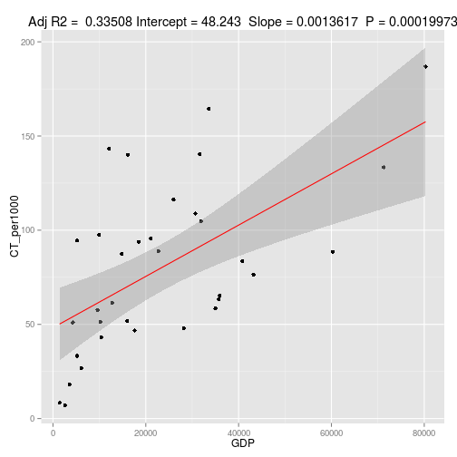

Which factors influence the frequency of medical examinations?
========================================================
Author: Andreas Jahnen

Dose Data MED Project Pitch

Date: 27.12.2015

Introduction
========================================================

It is assumed that low dose radiation has an stochastik effect on the human body, such 
as an increased cancer risk. For the different stakeholders in Europe, the Dose Data Med II (http://ddmed.eu) project was initiated to give an overview of situation and trends in Europe and therefore DDMed has collected data about medical radiation doses and frequencies in Europe.

**This project uses the collected frequency data and adds new data like Gross domestic product (GDP), Number of CT scanners, Number of Radiologists and Number of General Practisioniers (GPs) in order to find influences of the countries examination frequencies.**

This is important, in order to protect the patients from too much radiation.

Materials and Methods
========================================================

<small>The raw frequency data was preprocessed in the following way:

The frequency data from 34 European country (20 most significant examinations) was used and totals have been calculated for xray, CT, Interventional procedures (IV), Nuclear Medicine (NM) and overall.

Additional country specific data has been added for each country: Gross domestic product (GDP), Number of CT scanners, Number of Radiologists and Number of General Practisioniers (GPs).

An **interactive R Shiny Application** has been created that allows the user to interactivly: (a) Select outcome and regression variable (Where is a relationship?), (b) Select the countries (What is the influence if I remove a country or not?) and (c) calculate a linear regression.
</small>

Results
========================================================

We can see in playing with the data several important observations:

  - Countries have a big influence on the data; Often there is no significant relationship, 
  - But **GDP and number of CT exminations** per 1000 have a significant relationship (R code dynamic, but not shown due to page limit.)

***

<small>
 
</small>
Conclusions
========================================================

  - To have a look at country specific factors in medical examination frequencies can give us information for decision makers.
  - We have observed a significant relationship between GDP (as richness of a country) and CT examinatoin frequency. 
    - In richer countries, more CT examinations are performed.
    - The relationship is significant, but not very strong, that assums, other factors do influence the relationship strongly.
  - **Future work:** (a) Work with models with more than one variable, (b) use non-linear models and exploring other country factors, like % of healthcare spending, .... 
